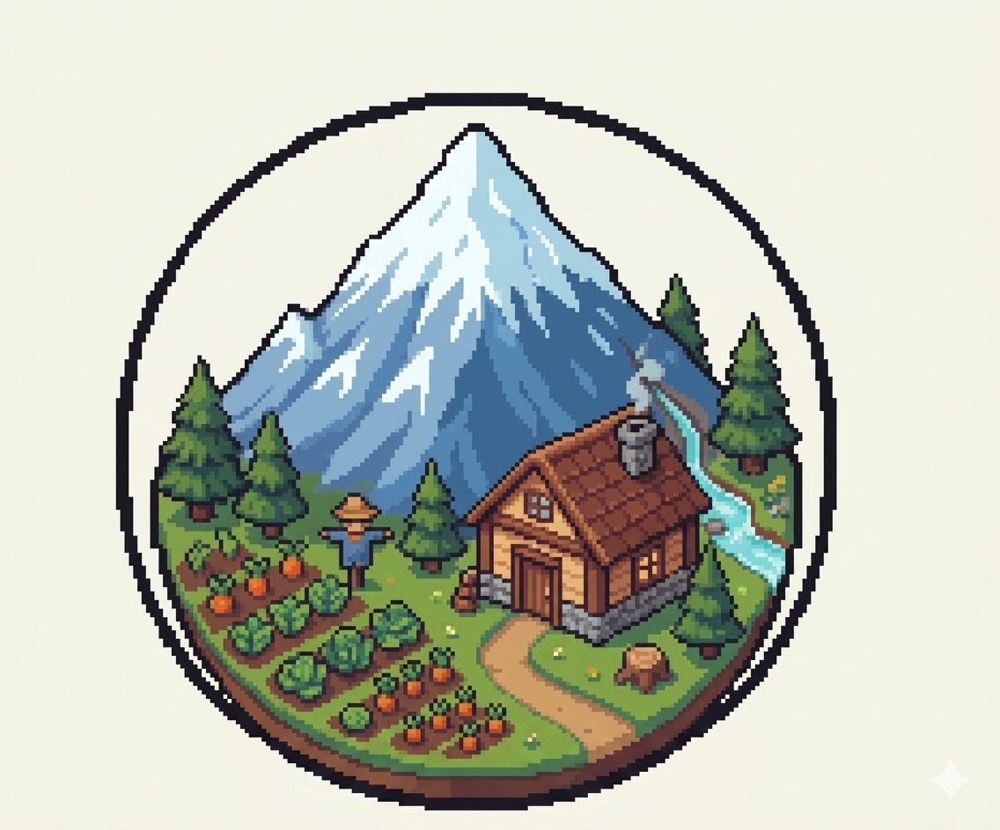

# Hola! Soy Luciano Iván Alvarez 👋

**Software Developer | RPA Architect | Mechatronics & AI**

Soy un desarrollador de software con sede en Cipolletti, Río Negro, enfocado en la creación de automatizaciones inteligentes e interfaces robustas. Mi perfil combina dos mundos: pasé más de 10 años como técnico y coordinador del mantenimiento mecatrónico de activos críticos en el sector Oil & Gas y hoy traslado esa mentalidad de "cero fallas" al diseño de arquitecturas de software resilientes. 

Actualmente soy estudiante avanzado de la Licenciatura en Inteligencia Artificial y Robótica en la Universidad Siglo 21.

### 🚀 ¿En qué estoy trabajando?

* **Arquitectura de Automatización (RPA):** Diseño de motores de ejecución basados en Grafos Acíclicos Dirigidos (DAGs) capaces de tomar decisiones en tiempo real e interactuar con software legacy mediante la API nativa de Windows.
* **Desarrollo Full Stack:** Orquestación de ecosistemas que conectan agentes locales en **.NET/C#** con backends analíticos en **Python (FastAPI)** y dashboards dinámicos en **Angular**.

### 🛠️ Stack Tecnológico y Herramientas

  
  
  
  
  
  
  

### ⚡ Datos Curiosos sobre mí

- 🐈 **Mushu y Miu:** Mis mejores amigos de la vida. Mis dos gatos que me acompañan y supervisan mientras tiro líneas de código.
- 🛹 **Skate & Longboard:** Fuera de las pantallas, estoy aprendiendo a andar (soy principiante, pero disfruto el proceso!).
- 🎸 **Música:** Me gusta mucho el indie, el rock, metal, punk y el folclore. Me encanta tocar instrumentos y descubrir nuevos sonidos.
- 🌱 **Botánica Hogareña:** Aficionado al cuidado de plantas de interior; siempre buscando sumar un poco de verde a mi espacio de trabajo.
-  **Mi sueño:** Es tener una casita en la montaña, una bonita familia, un jardin con huerta, y poder disfrutar de una vida tranquila.

### 📫 Conectemos

  <a href="https://www.linkedin.com/in/lucian94ia" target="_blank">
    
  </a>

